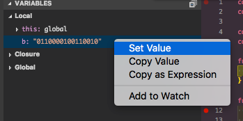

# Express

This example shows that you can even do a debug on express.
Using the integrated terminal, run the server, and then run the curl commands using `curl.sh`.

## Lesson

Use a conditional break point to stop at the appropriate command

You will get another popup showing the types of breakpoints that you can set.

#### Hit Count

This will stop at the break point after the particular line of code has been run X times.

#### Expression

This will stop at the break point when the given expression evaluates to True.

### Modifying Data

Inside the Variables tab, you can modify data by either Double Clicking or Right Clicking, and selecting `Set Value`

## Assignment

You have a server that is getting hit by requests from a bash script. One of the requests is a special request that you want to service in a different way, for debugging purposes.

**DO NOT MODIFY CODE**

First use the breakpoint hit times to find the correct call, then use the breakpoint edit to find the right call.

We will first use the `Hit Count` break point type, then the `Expression` type to find exactly which output we want.

Then, set the value of the `output` variable to return to the `curl.sh` the message it is looking for.

The message it wants is `"Hello"`, but it only wants this when it says `Waiting for 'Hello' from the server`.

## Output

The output you are trying to solve for is on the `curl.sh`.

The final output will look something like this.

## Bonus

Use breakpoints to debug the `convert` function, to convert the binary expression back to a string before printing it in the console.
