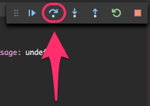
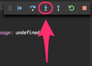
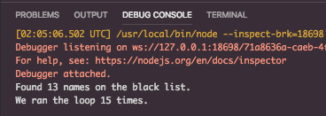

# Double For Loop

This example shows how to use the step function to navigate and get deeper into our code.

We will also be learning how to skip files we don't want to debug through.

## Lesson

### Step Over

The `Step Over` function allows you to step over a piece of code. You do not care about the code underneath, and instead you are just interested in going to the next line of code.

### Step Into

The `Step Into` function allows you to step into a line of code, to explore the nest functions.

## skipFiles

The `skipFiles` attribute in the `launch.json` allows us to skip certain files that we know we do not need to debug. This list a blacklist containing files that the debugger will not step through.

This is particularly useful when there are files we do not need to look at.

## Assignment

Place a breakpoint on line 44, and run `Launch Ex4`, and `Step Into` the line of code.

**DO NOT PLACE ANY MORE BREAKPOINTS OTHER THAN THE ONE ON LINE 44**

You'll notice that when we `Step Into`, we also step into the `getCorpus` function from the data. We don't really want that, so follow the lesson and add the `data.js` file to the `skipFiles` blacklist. This will make our debugging operation a lot easier.

As we go through the `isNameOnBlackList` function, you'll notice that it is quite slow. We have to go through the loop so many times! Stepping through the code in this manner allows us to clearly understand the time it takes for the computer to execute each line.

The current heuristic is `O(n^2)`, because it takes two for loops to run. Can we make this faster?

Make the running time of the code into `O(n)` using a hashmap or a set.

## Output

